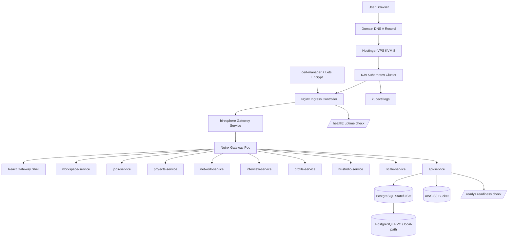
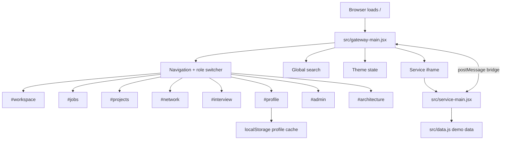
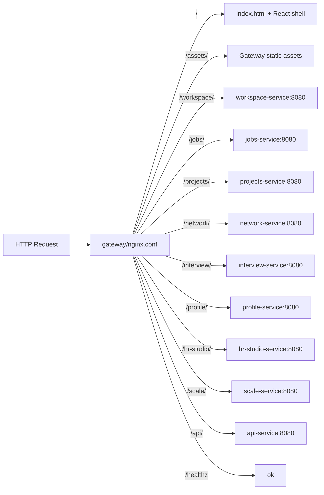
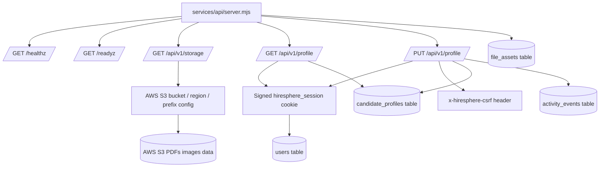
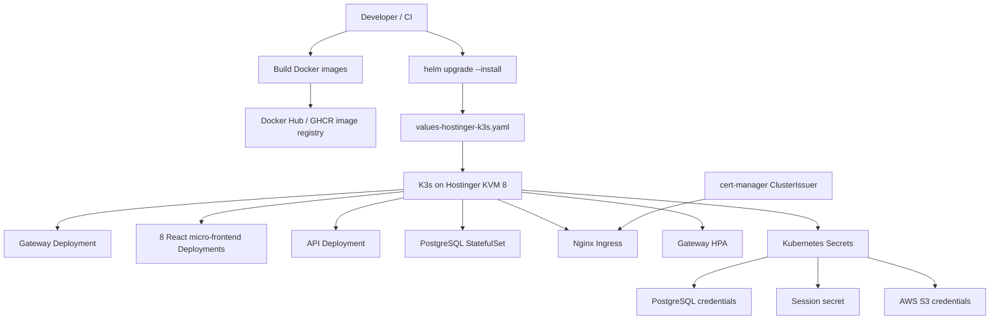
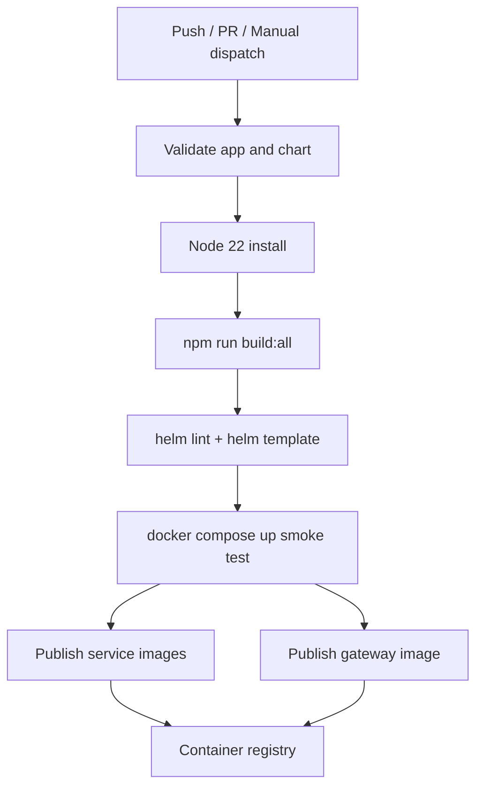
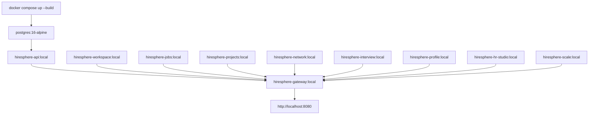

# hiresphere Flow Chart

## Stack Summary

Frontend: React.js
Backend: Node.js API service
Database: PostgreSQL
File Storage: PostgreSQL persistent volume plus AWS S3 for PDF/images/data
Web Server: Nginx
Deployment: K3s Kubernetes
Monitoring: Uptime endpoints plus Kubernetes logs
Server: Hostinger VPS KVM 8
Ingress: Nginx Ingress
SSL: cert-manager

## Production Runtime Flow

## Frontend Application Flow

## Gateway Routing Flow

## Backend And Storage Flow

## K3s Deployment Flow

## CI/CD Flow

## Local Docker Compose Flow

